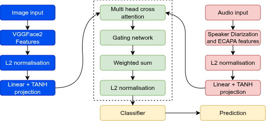

# Face_Voice_Association
# CAFNet: Cross-Attentive Face-Voice Fusion Network



This repository contains the official PyTorch implementation of **CAFNet** (Cross-Attentive Face-Voice Fusion Network).

**CAFNet** is a multimodal fusion framework designed for robust face-voice association and verification, particularly in challenging multilingual environments. It introduces a bidirectional cross-attention mechanism to align speaker embeddings (ECAPA-TDNN) and face embeddings (VGGFace2), optimized with a Fusion Orthogonal Projection (FOP) loss to enforce identity separation in the joint latent space.

## 📄 Abstract
Face-voice association seeks to verify whether a face image and a speech segment belong to the same identity. Real-world audio-visual data are noisy, multilingual, and frequently multi-speaker; robustness to these conditions is critical for deployed systems. 

We present CAFNet, which combines a practical audio preprocessing pipeline (diarization + cleaning) with strong modality-specific embeddings and a bidirectional cross-attention fusion head. We report significant improvements over baseline methods on the MAV-Celeb dataset, demonstrating that the architecture consistently improves cross-modal alignment and is compact enough to train on limited multimodal data.

## ✨ Key Features
- **Advanced Fusion**: Bidirectional Cross-Attention (Audio queries Face / Face queries Audio) followed by Gated Fusion.
- **State-of-the-Art Backbones**: 
  - **Audio**: ECAPA-TDNN (SpeechBrain)
  - **Visual**: VGGFace2 (ResNet50)
- **Robust Training**: Utilizes Fusion Orthogonal Projection (FOP) loss to enforce orthogonality between different identities.
- **Preprocessing Pipeline**: Integrated support for Speaker Diarization (`pyannote.audio`) and signal cleaning (Wiener filtering).

## 📂 Repository Structure
```text
CAFNet/
├── assets/             # Architecture diagrams
├── features/           # Scripts for extracting embeddings (ECAPA/VGGFace2)
├── preprocessing/      # Audio cleaning and diarization tools
├── src/                # Core model definitions, datasets, and loss functions
├── checkpoints/        # Saved models (created during training)
├── train.py            # Main training script
├── inference.py        # Evaluation/Testing script
└── requirements.txt    # Python dependencies
